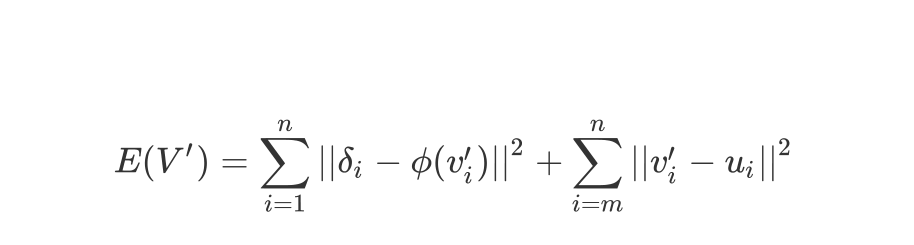

## Deformation 

- Reproduced paper:

	Olga Sorkine, Daniel Cohen-Or, et al.  2004. Laplacian Surface Editing.  In Proceedings of the Eurographics/ACM SIGGRAPH Symposium on Geometry Processing, 175–184.

### Introduction

- Laplacian surface editing

- constant Laplacian:

  

- Energy function used:

  

#### External library

- [GLFW](https://www.glfw.org/) and [Glad](https://glad.dav1d.de/)

- [Assimp](https://www.assimp.org/)

- [glm](https://github.com/g-truc/glm)

- [Eigen](https://eigen.tuxfamily.org/) 

#### display

- Armadillo  model: 494 vertices in ROI

- Bunny model: 1815 vertices in ROI

